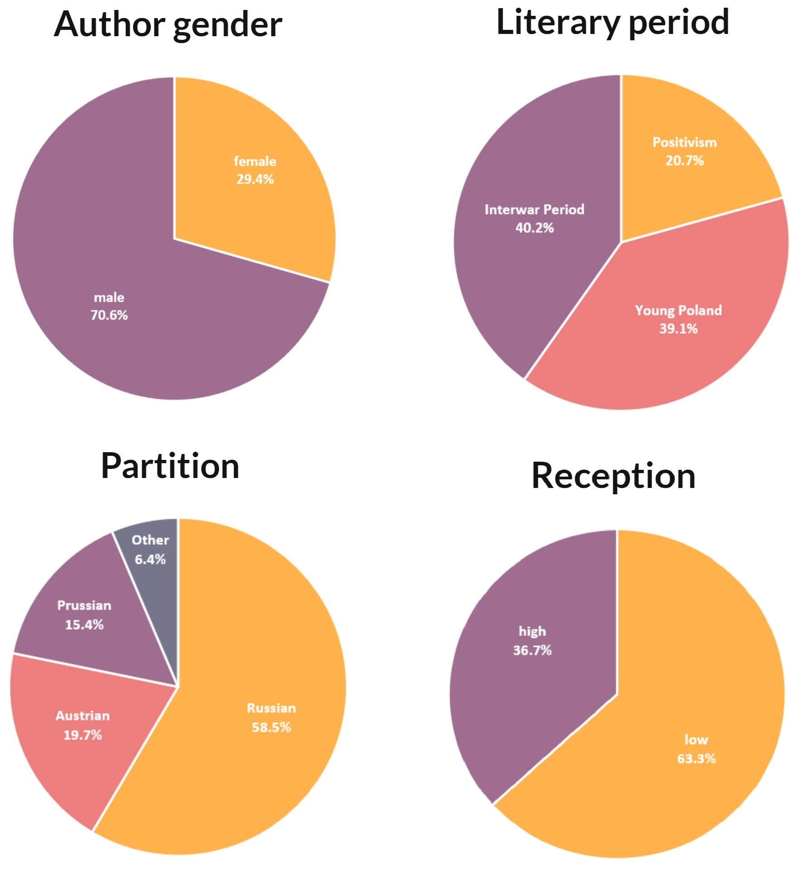
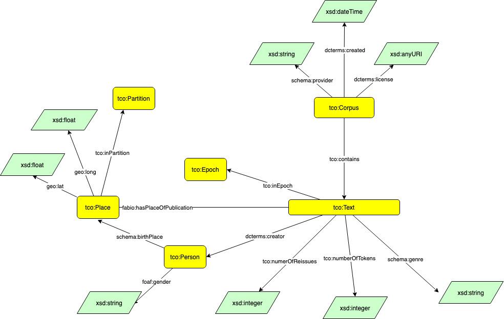
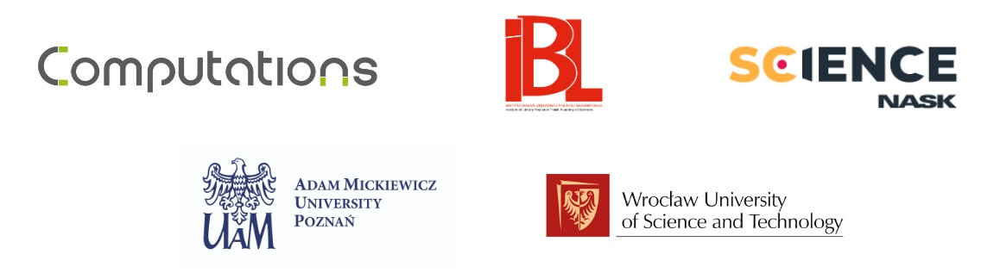

# 19-20MetaPNC
***Metadata-enriched Polish Novel Corpus from the 19th and 20th centuries***

The corpus consists of 1,000 novels originally written in Polish and initially published as books between 1864 and 1939, with the plot timeframe set after 1815. The current version is v1.0.1.

Following Linked Open Data (LOD) standards, we do not publish the corpus texts in .txt format. Instead, the entire corpus is accessible through a knowledge graph in .ttl format, with each text being linked separately. The following sections include a tutorial and code explanation to assist in downloading all the corpus texts independently.

## Contributors

- **Marek Kubis**, Adam Mickiewicz University in Poznan
- **Cezary Rosiński**, Institute of Literary Research of the Polish Academy of Sciences
- **Patryk Hubar**, Institute of Literary Research of the Polish Academy of Sciences **|** Univeristy of Warsaw
- **Agnieszka Karlińska**, NASK National Research Institute
- **Jan Wieczorek**, Wroclaw University of Science and Technology

## Corpus design

The collected texts come from different sources.
The initial set consisted of 100 novels from the [Polish ELTeC subcorpus](https://distantreading.github.io/ELTeC/pol/index.html), encoded in TEI format.
Subsequently, an additional 193 texts from the [Wolne Lektury](https://wolnelektury.pl/) library were added. The Wolne Lektury data is accessible in a custom XML format that preserves paragraph boundary information.
Next, 225 novels from the Polish edition of the [Wikisource](https://pl.wikisource.org/wiki/Wiki%C5%BAr%C3%B3d%C5%82a:Strona_g%C5%82%C3%B3wna) project were included, encoded in MediaWiki format and proofread by Wikisource editors.
The [Polona](https://polona.pl) digital library, maintained by the National Library of Poland, served as the final source of texts. It provides scans of printed books along with the OCR-derived textual layer. Approx. 6,000 digitized volumes were retrieved from Polona, which, after merging multi-volume editions of novels, resulted in a total of 4,808 texts.

Exactly one edition of each novel was selected from the 5,326 pieces of literary fiction that made up the original dataset. Texts that were not novels, that were written before or after the selected period, and that were set before 1815 were rejected. Duplicates were also identified and removed, resulting in a database of 1,707 unique novels.

### Balancing criteria

The corpus was balanced historically and geographically. Since it was impossible to achieve equal proportions between the classes, we determined the minimum and maximum share of a particular text class in the corpus. Our priority was to balance the corpus based on the date and place of publication.
1. Date: three literary eras distinguished in Polish literary studies determined by the date of first publication (>= 20% each)
   - Positivism (1864–1890)
   - Young Poland (1890–1918)
   - the Interwar Period (1918–1939)
2. Gender: female author 10%–50%
3. Place of publication (three partitions): >=15% each
4. Level of reception:
   - no more than 2 reprints >= 30%
   - more than 2 reprints >= 30%

The following proportions of titles were obtained for each balance criterion:

<p align="center">
  
</p>


#### Text Corpora Ontology
The **Text Corpora Ontology** (TCO) is an ontology specifically designed for publishing text corpora within a Semantic Web environment. This ontology mainly identifies the objects and their relations through bibliographic connections that occur between written documents, such as books, journal articles, and conference papers. However, the ontology also extends to include elements that are pertinent from the standpoint of corpus creation. These elements encompass the balance, representativeness, and relevance of the corpus to the problem being addressed by the algorithm trained using the prepared set of texts.

**TCO** employs existing ontologies, including [schema.org](https://schema.org/), [FOAF](http://xmlns.com/foaf/0.1/), [BiRO](https://sparontologies.github.io/biro/current/biro.html#classes), [FaBiO](http://www.sparontologies.net/ontologies/fabio), and [Geographical Entity Ontology](https://www.ebi.ac.uk/ols/ontologies/geo). However, work on the ontology's final version is still underway.




#### Classes

- a single text (**tco:Text**),
- the entities responsible for the single text, in particular persons (**tco:Person**),
- places of publication and other locations relevant to the balance of the corpus (**tco:Place** and **tco:Partition**),
- time periods, in particular literary epochs (**tco:Epoch**).


In addition, a general Corpus class (**tco:Corpus**) is also specified, representing a single set of texts.

#### Attributes and relations

The attributes of the individual classes comprising the ontology not only enable the description of basic bibliographic information, such as title, authorship, and place of publication, but also include attributes important to the process of corpus construction. These latter attributes have been identified based on an extensive analysis of existing text collections and their respective construction principles. For individual classes, these attributes might encompass:
- **foaf:gender** and **schema:birthPlace** for **tco:Person** class,
- **tco:numberOfReissues**, **tco:numberOfTokens** and location of the place of publication in a particular partition (**tco:inPartition**) for **tco:Text** class,
- information on the literary period within which the text included in the corpus was written (**tco:inEpoch**).

Each class instance can be further extended with external identifiers (**owl:sameAs**), and individual documents can contain direct references to full-text files (**schema:contentUrl**).

#### Examples

The corpus data model was built on the basis of the general TCO ontology. Few examples for each class are presented below.

```turtle
tco:metapnc_e_1572 a dcterms:PeriodOfTime ;
    rdfs:label "Interwar period" ;
    tco:isEpoch true ;
    owl:sameAs <https://www.wikidata.org/wiki/Q11761904> .

tco:metapnc_p_1100 a foaf:Person ;
    rdfs:label "Jezierski, Edmund" ;
    schema:birthPlace tco:metapnc_g_1418 ;
    owl:sameAs <http://www.wikidata.org/entity/Q21288157> ;
    foaf:gender "male" .

tco:metapnc_g_1418 a dcterms:Location ;
    rdfs:label "Warsaw" ;
    tco:inPartition tco:metapnc_z_1571 ;
    owl:sameAs <http://www.wikidata.org/entity/Q270>,
        <https://www.geonames.org/756135> ;
    geo:lat "52.22977"^^xsd:float ;
    geo:long "21.01178"^^xsd:float .

tco:metapnc_z_1571 a dcterms:Location ;
    rdfs:label "Russian Partition" ;
    tco:isPartition true ;
    owl:sameAs <https://www.wikidata.org/wiki/Q129797> .

tco:metapnc_b_246 a tco:Text,
        dcterms:BibliographicResource ;
    tco:inEpoch tco:metapnc_e_1572 ;
    tco:numberOfReissues 1 ;
    tco:numberOfTokens 76607 ;
    dcterms:creator tco:metapnc_p_1100 ;
    dcterms:date "1925"^^xsd:year ;
    dcterms:subject "Plot after the Congress of Vienna" ;
    dcterms:title "Wyspa Lenina" ;
    fabio:hasPlaceOfPublication tco:metapnc_g_1418 ;
    schema:contentUrl <https://polona2.pl/archive?uid=84911046&cid=87260474> ;
    schema:genre "Novel" ;
    owl:sameAs <http://polona.pl/item/84911046> .
```


## Data
The texts collected in the corpus can be retrieved directly from their providers using `fetch-data.py` script.

```
python fetch-data.py
```

Note: The script requires [RDFLib](https://rdflib.readthedocs.io/) and [Requests](https://requests.readthedocs.io/) libraries to run.
```
pip install rdflib
pip install requests
```

## Licence

The knowledge graph and code in the repository are made available under a Creative Commons Attribution International 4.0 licence [(CC BY)](https://creativecommons.org/licenses/by/4.0/).
The texts in the corpus are in the public domain. Detailed information about the licences can be found at the following links:
- [Polona (pl)](https://polona.pl/static/polona/22d8f8e5-078f-41f1-93ed-daceb2ef98c7), [Polona (en)](https://polona.pl/static/polona/d59af5c6-45fb-4a79-8b79-ab0369067931)
- [Wolne Lektury](https://wolnelektury.pl/info/zasady-wykorzystania/)
- [Wikisource](https://foundation.wikimedia.org/wiki/Policy:Terms_of_Use/pl)

## Citation

Agnieszka Karlińska, Cezary Rosiński, Jan Wieczorek, Patryk Hubar, Jan Kocoń, Marek Kubis, Stanisław Woźniak, Arkadiusz Margraf, and Wiktor Walentynowicz. 2022. [Towards a contextualised spatial-diachronic history of literature: mapping emotional representations of the city and the country in Polish fiction from 1864 to 1939](https://aclanthology.org/2022.latechclfl-1.14). In *Proceedings of the 6th Joint SIGHUM Workshop on Computational Linguistics for Cultural Heritage, Social Sciences, Humanities and Literature*, pages 115–125, Gyeongju, Republic of Korea. International Conference on Computational Linguistics.

```
@inproceedings{karlinska-etal-2022-towards,
    title = "Towards a contextualised spatial-diachronic history of literature: mapping emotional representations of the city and the country in {P}olish fiction from 1864 to 1939",
    author = "Karli{\'n}ska, Agnieszka  and
      Rosi{\'n}ski, Cezary  and
      Wieczorek, Jan  and
      Hubar, Patryk  and
      Koco{\'n}, Jan  and
      Kubis, Marek  and
      Wo{\'z}niak, Stanis{\l}aw  and
      Margraf, Arkadiusz  and
      Walentynowicz, Wiktor",
    booktitle = "Proceedings of the 6th Joint SIGHUM Workshop on Computational Linguistics for Cultural Heritage, Social Sciences, Humanities and Literature",
    month = oct,
    year = "2022",
    address = "Gyeongju, Republic of Korea",
    publisher = "International Conference on Computational Linguistics",
    url = "https://aclanthology.org/2022.latechclfl-1.14",
    pages = "115--125",
    }
```
---

